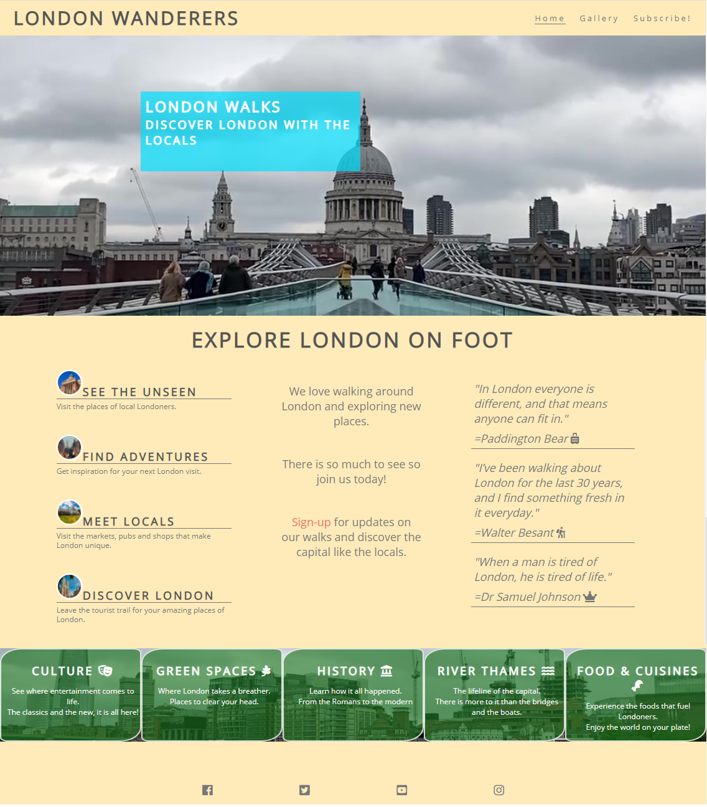

# London Wanderers

## Introduction
_London Wanderers_ is a local travel blog focusing on urban walks in and around London. The walks are centred around one of 5 themes:
* Culture
* Green Spaces
* History
* River Thames
* Food & Cuisine

The goal of _London Wanderers_ is to encourage visitors to learn about interesting spots in London and explore them on their own. Visitors can sign-up to a newsletter that will deliver latest walks to their inbox.

## Client & User Needs

### Audience
London Wanderer’s target audience comes from a variety of socio-economic backgrounds. Their common denominator is a passion for exploring the area of Greater London on foot. They look for interesting and inspirational walk ideas that they can easily accomplish no matter their fitness level.

### User stories 
As a user visiting the website for the first time:
* I want to be able to see photos taken during walks to help me decide what places to visit
* I want to be able to subscribe or follow on social media
* I want to know what types of walks are available

As a user returning to the website:
* I want to be able to easily access the site on various devices of my choice
* I want to be able to easily navigate to different parts of the website
* I want to be able to contact the owner via the website or social media

### Client stories
As a site owner:
* I want the website to have a clean and modern design and easy to follow navigation
* I want to have a gallery to easily display photos taken during our walks
* I want to feature links to our social media profiles (Youtube, Instagram, Facebook)
* I want to have a contact form so that the visitors can get in touch with me

## Design

### Mood boards
Font-family is [Open Sans](https://fonts.google.com/specimen/Open+Sans) with the basic text colour set to #777777.  Font colour changes only for a handful of elements:
* #FFFFFF - hero image cover text
* #FAFAFA - walk categories
* #FFFFFF - sign-up form

The basic colours are #FFEBB9 (background colour) and #777777 (basic text colour). Additionally the following colours are used:
* #555555 – welcome header on _Home_ page
* #FFFFFFF – hero image cover text and image border
* #0DFFD – hero image cover text background on _Home_ and _Subscribe!_ page
* #F16C6b – sign up form button and links in text
* #FAFAFA – walk categories text on _Home_ page
* #1D741D – walk categories background colour

Icons are sourced from [Font-Awesome](https://fontawesome.com/v5.15/icons?d=gallery) and use #777777 as their basic colour. For walk categories section on _Home_ page colour is changed to #FAFAFA.

Highlights/benefits of walking on _Home_ page are decorated with a photo with 3px rounded #FFFFFF border.  They use two font sizes – bigger one to attract attention and smaller one to provide more information.

Quotes displayed on _Home_ page follow the default font settings but the font style is italic. They also use some [Font-Awesome](https://fontawesome.com/v5.15/icons?d=gallery) icons for decoration.

Walk categories section on Home page consists of five #1D741D semi-transparent boxes with #FAFAFA text and [Font-Awesome](https://fontawesome.com/v5.15/icons?d=gallery) icons for decoration. The background for the whole section is an image.

Photos displayed on _Gallery_ page have a caption and a 5px solid #FFFFFF border. 

The form on _Subscribe_! page is located on top of a hero image within a #0DFFD semi-transparent box.

Fig 1 shows a visual representation of _London Wanderers’_ mood board.

### Initial Site Map

The website consists of three pages _Home_, _Gallery_ and _Subscribe!_

_Home_ page provides a brief introduction together with different walk categories. 

_Gallery_ displays a selection of photos from different London Wanderers’ walks.

_Subscribe!_ contains a subscription form to email updates.

Fig 2 shows the initial site map including types of content on each page.

### Storyboards

A proposed storyboard for _Home_ page:

A proposed storyboard for _Gallery_ page:

A proposed storyboard for _Subscribe!_ page:

### Final Navigation Map

The navigation map includes three pages with Home page being the main page. The structure is fairly flat with no sub-pages.

## Implementation
### Technologies
* [HTML5](https://developer.mozilla.org/en-US/docs/Web/HTML) – a mark-up language used to define the meaning and structure of the website
* [CSS3](https://developer.mozilla.org/en-US/docs/Web/CSS) – a stylesheet language used to style the website
### Tools
* [VS Code](https://code.visualstudio.com/) – a source code editor used to code the website
* [Github](https://github.com/) – a version control system used to store the website’s source code
* [Gitpod](https://www.gitpod.io/) – a container-based development platform used to run the dev environment
* [W3C Markup Validation Service](https://validator.w3.org/) – a mark-up validator used to check validity of HTML code
* [W3C CSS Validation Service](https://jigsaw.w3.org/css-validator/) – a stylesheet validator used to check validity of CSS code
* [Chrome DevTools](https://developer.chrome.com/docs/devtools/) – a set of dev tools used to test site’s responsiveness and identify bugs
* [Font-Awesome](https://fontawesome.com/v5.15/icons?d=gallery&p=2) – a font and icon toolkit used to source the icons
### Images
All images were provided by the website owner. They were taken during _London Wanderers_ walks and feature interesting places across London.

## Test Plan
### HTML & CSS Validation
Website HTML and CSS code were successfully validated using [W3C Markup Validation Service](https://validator.w3.org/) and [W3C CSS Validation Service](https://jigsaw.w3.org/css-validator/). Figs 7 – 10 show the validation reports.

### Functionality Testing
Basic functionality testing was done on Windows 10 using Chrome Web-browser. All test cases passed and the summary is available below:

### Responsiveness Testing
Responsiveness testing was done using Chrome Web-browser on:
* A Samsung Galaxy S7 mobile phone (Android 8.0.0) – screen size up to 380px
* A Samsung Galaxy Tab E 9.6 tablet (Android 7.1.2) – screen size up to 800px
* Asus N56V laptop (Windows 10) – screen size up to 1920px

## Bugs
### Images Not Found
During the testing process there was a problem with images being not found. After closer look, it turn out there was a typo in the pathname. The issue was fixed by correcting the path.
### Missing Social Media Icons On Gallery Page
During the development process the social media icons were displayed correctly on all pages except of gallery page. The issue was caused by the missing Font-Awesome script. Once it was added to <head> section of the page, the icons were correctly displayed.
### Figure Tag Breaking On Smaller Screens
When testing _Gallery_ page for smaller screens, figure tag would get split between two columns with img being shown at the bottom of one column and figcaption at the top of the next one. The issue was fixed by applying _break-inside:avoid_ to figure tag.
### Website Not Readable On Mobile Phones
The website became not readable and hard to use on very small screens. The elements would overlap, half of the form was not visible, images too small and text was too big. To resolve this the CSS file was updated with a style of screen resolutions with max width of 380px.

## Evaluation

_Appraisal:_

The submitted website meets the objectives of:
1.	Presenting public introduction to the travel blog.
1.	Providing a channel to attract audience and viewership.
1.	Established a public platform to share content.

_Limitations:_

The submitted website has:
1.	Limited content availability.
1.	Static website structure.

_Recommendations:_

Possible future additions to the website include:
1.	Inclusion of other media format (e.g. videos).
1.	Additional interaction attributes (e.g. comments and feedback sections).
1.	More forms of content (e.g. blog posts and recommendations section).

## Appendices
### Screen Dumps

### Website Assets
The website can be viewed online at [https://poay-kin-loo.github.io/Milestone-1-London-Wanderers/](https://poay-kin-loo.github.io/Milestone-1-London-Wanderers/)

The website assets include:
* Milestone-1-London-Wanderers/css/style.css
* Milestone-1-London-Wanderers/images/Round01.jpg
* Milestone-1-London-Wanderers/images/Round02.jpg
* Milestone-1-London-Wanderers/images/Round03.jpg
* Milestone-1-London-Wanderers/images/Round04.jpg
* Milestone-1-London-Wanderers/images/image01.jpg
* Milestone-1-London-Wanderers/images/image02.jpg
* Milestone-1-London-Wanderers/images/image03.jpg
* Milestone-1-London-Wanderers/images/image04.jpg
* Milestone-1-London-Wanderers/images/image05.jpg
* Milestone-1-London-Wanderers/images/image06.jpg
* Milestone-1-London-Wanderers/images/image07.jpg
* Milestone-1-London-Wanderers/images/image08.jpg
* Milestone-1-London-Wanderers/images/image09.jpg
* Milestone-1-London-Wanderers/images/image10.jpg
* Milestone-1-London-Wanderers/images/image11.jpg
* Milestone-1-London-Wanderers/images/image12.jpg
* Milestone-1-London-Wanderers/images/main1.jpg
* Milestone-1-London-Wanderers/images/riverlondon.jpg
* Milestone-1-London-Wanderers/images/signuplondon.jpg
